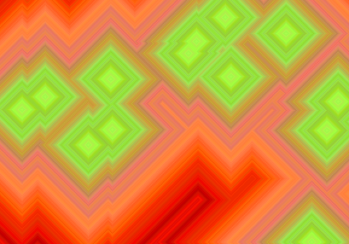

Some time ago I wrote a program for visualizing search algorithms in a grid. A relatively simple [Breadth first search](https://en.wikipedia.org/wiki/Breadth-first_search) that mutate its color on each search depth over a grid.

Nice plots. Extremely slow.

<table>
  <tr>
    <td></td>
    <td></td>
    <td></td>
    <td></td>
  </tr>
  <tr>
    <td></td>
    <td></td>
    <td></td>
    <td></td>
  </tr>
  <tr>
    <td></td>
    <td></td>
    <td></td>
    <td></td>
  </tr>
  <tr>
    <td></td>
    <td></td>
    <td></td>
    <td></td>
  </tr>
  <tr>
    <td></td>
    <td></td>
    <td></td>
    <td></td>
  </tr>
</table>
So I tried to rewrite it in a more efficient fashion, but somewhere on the process I made a mistake in the code, and there it was: an unexpected fractal suddenly appeared.

